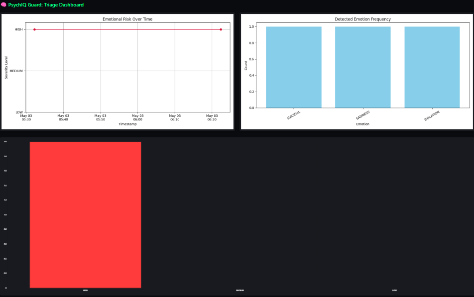
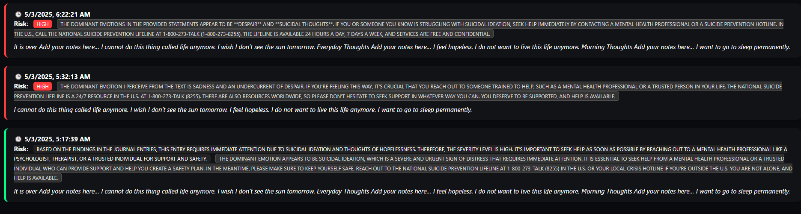

# PsychIQ Guard 🗡️

A mental health journaling triage system that scans your **Notion journal pages**, analyzes emotional content, classifies entries based on **severity**, identifies **dominant emotions**, generates **summaries**, and optionally **sends alerts** for high-risk entries. Built to run in the background while you journal naturally.

---

## 🚀 Features

* ✍️ Real-time and scheduled emotional triage from Notion pages
* 📈 Dashboard to visualize severity trends and emotion patterns
* 📊 Generates summaries for each journal entry
* 🚨 Email alerts for HIGH-risk mental health content
* ✨ No need to write inside a Notion table, works with natural free-form pages

---

## 📂 Folder Structure

```
psychic-guard/
├── app.py                         # Flask dashboard app
├── .env.example                  # Sample environment configuration
├── data/                         # Stores triage log
│   └── page_triage_log.json
├── notion/                       # Scripts for Notion integration & triage
│   ├── guardian.py
│   ├── notion_logger.py
│   ├── notion_periodic_triage.py
│   ├── notion_scan_all_shared_pages.py
│   ├── notion_generate_summaries.py
│   └── send_email_alert.py
├── static/
│   └── visuals/                  # Contains generated visualizations
│       ├── risk_timeline.png
│       └── emotion_frequency.png
├── templates/
│   └── dash.html                 # Dashboard UI
├── visualize/
│   └── pattern_visualizer.py    # Graphs emotion & severity trends
└── requirements.txt             # Python dependencies
```

---

## 📅 Prerequisites

* Python 3.9+
* A Notion integration token ([how to get one](https://developers.notion.com/docs/getting-started))
* OpenRouter API key (for LLM-based emotion + summary)
* Gmail (with App Password enabled) for optional email alerts

---

## 📁 .env.example

```env
# OpenRouter LLM key
OPENROUTER_API_KEY=

# MongoDB (optional)
MONGO_URI=

# Notion integration
NOTION_API_KEY=
NOTION_JOURNAL_DB_ID=   # Optional if only using free-form pages

# Email Alert Config (Optional)
ALERT_EMAIL_ADDRESS=
ALERT_EMAIL_PASSWORD=
ALERT_TO_EMAIL=
```

> Do NOT commit your `.env` file.

---

## 🚧 Setup Instructions

1. **Clone the Repo**

```bash
git clone https://github.com/yourusername/psychic-guard.git
cd psychic-guard
python -m venv venv && source venv/bin/activate  # or venv\Scripts\activate on Windows
pip install -r requirements.txt
```

2. **Create and Configure .env**
   Copy `.env.example` to `.env` and fill in your credentials.

3. **Share Notion pages with your integration**

* Open each page you want triaged
* Click **Share → Connections → Invite your integration** (e.g., PsychicGuard)
* Grant **Read / Insert / Update** access

4. **Run Once to Generate Logs**

```bash
python notion/notion_scan_all_shared_pages.py
```

5. **Visualize Emotion Trends**

```bash
python visualize/pattern_visualizer.py
```

6. **Start Dashboard**

```bash
python app.py
```

Visit: [http://127.0.0.1:5001](http://127.0.0.1:5001)

---

## 🔔 Alerting Behavior

* Emails are sent **only when a new HIGH-risk entry** is detected
* Summary + emotion + timestamp are included

---

## 💊 Intended Use

This project is intended for **self-reflection and early risk signals**, not as a substitute for professional mental health support. If in distress, reach out to a licensed mental health professional or local helpline.

---

## 🎓 Credits

Built with ❤️ by Hari Priya

* Uses Notion API
* Uses OpenRouter LLMs (Mistral-7B-Instruct)
* Frontend: Flask + Chart.js + Bootstrap

---

## ⚡ Future Enhancements

* GPT-based weekly mood summaries
* Smart tag classification for journal clusters
* SMS alert integration (Twilio or Email-to-SMS)

---

## 🌐 License

MIT License

---

## ✨ Demo



---

## ✉ Feedback

PRs and issues welcome! Let me know how this tool helps you or what you’d love to see next.
